# Commerce architecture

The runtime remains React + TypeScript → local Node/Express → commercetools. Credentials and SDK response types stay on the server. React consumes app DTOs from `shared/domain`, enriched by pure frontend mappers where presentation needs option labels or swatch metadata.

```mermaid
flowchart LR
  App --> BrandProvider
  BrandProvider --> CartProvider
  CartProvider --> CatalogProvider
  CatalogProvider --> StorefrontLayout
  StorefrontLayout --> PageOutlet
  PageOutlet --> Features
  Features --> Services
  Services --> HTTP[commerce-client]
  HTTP --> Express
  Express --> SDK[Store-scoped commercetools service]
  SDK --> Mappers[server mappers]
  Mappers --> DTO[shared/domain DTOs]
```

| Responsibility                 | Owner                                                   |
| ------------------------------ | ------------------------------------------------------- |
| Public brand configuration | `shared/brands`                                         |
| Theme and active brand         | `src/brands/BrandProvider.tsx`                          |
| URL parsing/history/links      | `src/app/routes.ts`, `router.tsx`                       |
| Application composition        | `src/App.tsx`                                           |
| Shared shell                   | `src/app/StorefrontLayout.tsx`, `src/components/layout` |
| Catalog and product reads      | `src/services/catalog-service.ts`, feature hooks        |
| HTTP transport                 | `src/services/commerce-client.ts`                       |
| SDK normalization              | `server/commercetools/mappers`                          |
| App DTOs                       | `shared/domain`                                         |
| Frontend product/cart models   | `src/domain`                                            |
| Cart source of truth           | `src/features/cart/CartProvider.tsx`                    |
| Page/brand styles              | `src/styles`, scoped `src/brands` overrides             |
| Retained demo                  | `src/legacy`, `shared/legacy`                           |

The internal router supports brand home, category (including query search), product, cart and checkout. Unknown paths and malformed encodings resolve to not-found. Native modified clicks, external links and downloads retain browser behavior. There is no router dependency. Brand subtree keys reset catalog/cart state when switching brands.

Product UUID, product key, localized slug, product number, variant ID and SKU are separate fields. New product links use the localized slug. Existing UUID deep links and the legacy UUID API remain supported intentionally. A missing product number displays a clearly labeled SKU; the mapper does not manufacture a product number from it. The current `product-number` attribute is the explicit source of product numbers.

Slug resolution reuses the existing Store catalog selection/publication/localization path. It is correct for this POC assortment, but scans pages and needs indexed lookup for scale. Store assignment queries already fan out per product; that pre-existing scalability limit is retained. No cache hides Merchant Center assortment changes.

One CartProvider owns cart, loading, errors, refresh, quantity updates, removal, mutation lock and minicart visibility. Request revisions prevent stale reads from replacing newer writes. Focus refresh skips pending writes. On conflict, refresh the server cart and require another user action; automatically replaying add could duplicate items. The server reads the current version and performs a versioned commercetools mutation. Cart versions are DTO metadata, not UI business logic. Store cookies remain HTTP-only and Store-scoped.

Checkout remains the existing local demo. Its contact/address/delivery/payment forms are focused components, and all cart data comes from CartProvider. No payment, order, marketing, reviews, promotions, or future integration service was added.

The original Everyday/Explore entry is lazy-loaded for the documented `/?store=` URLs. It has only its own Store settings and stylesheet. The API allowlist composes the storefront Store keys and the separate demo Store keys; storefront configuration does not depend on demo types. Demo and storefront applications reuse the same HTTP transport.

To replace Node later, implement the documented DTO endpoints and cookie/cart semantics. Presentation code does not import SDK modules.
